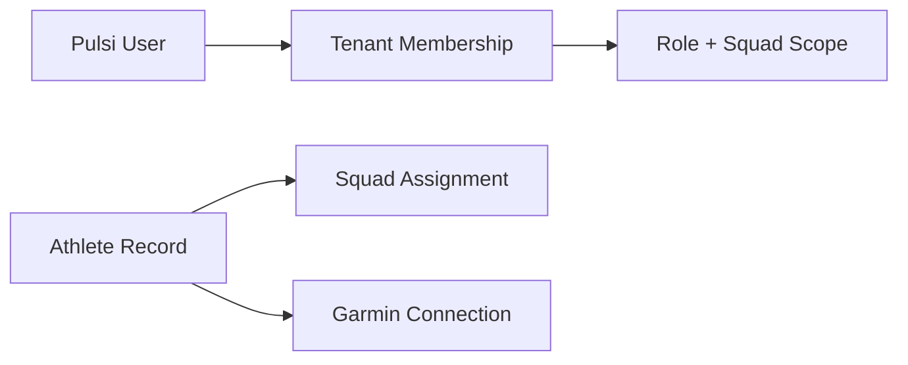
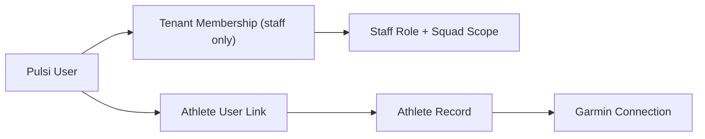

# Pulsi Auth And Actor Model

This document defines how identity, authentication, tenant access, staff roles, and future athlete accounts should work in Pulsi.

It exists to remove ambiguity between:

- staff users
- athlete domain records
- future athlete user accounts
- Garmin-linked athlete identities

It should be treated as the canonical design reference before implementing athlete accounts.

## 1. Current State

Today Pulsi has one fully implemented authenticated actor type:

- `staff user`

And one domain-only actor type:

- `athlete`

That means:

- staff can sign in to Pulsi with Better Auth
- athletes exist in the database as player records
- athletes do not yet sign in to Pulsi
- Garmin is connected to athlete records, not to staff accounts

## 2. Core Concepts

There are four different identity concepts in Pulsi:

### A. Pulsi User

Stored in Better Auth tables:

- `user`
- `session`
- `account`
- `verification`

This is an authentication identity.

It answers:

- who can log into Pulsi
- who owns a session

### B. Tenant Membership

Stored in:

- `tenant_memberships`

This links a Pulsi user to one organization.

It answers:

- which organization this staff user belongs to
- which staff role they have
- which squad scope they have

### C. Athlete Record

Stored in:

- `athletes`
- `athlete_squad_assignments`

This is a football player domain object.

It answers:

- who the player is
- which tenant they belong to
- which squad they currently belong to

### D. Garmin Athlete Identity

Stored in:

- `athlete_device_connections`
- `provider_credentials`

This is the external wearable identity and token set attached to an athlete record.

It answers:

- which Garmin account is linked to the athlete
- what permissions were granted
- which credentials Pulsi can use for ingestion

## 3. Current Actor Model

Today the system should be understood like this:

Important rule:

- staff users and athlete records are currently separate

There is no direct `user -> athlete` link yet.

## 4. How Staff Accounts Work Today

### Registration

1. A person creates a Better Auth account.
2. If they have no organization access, they land on `/welcome`.
3. They can either:
   - create a new tenant
   - accept an existing invitation

### Tenant Creation

When a user creates a tenant:

- a `tenants` row is created
- a `tenant_memberships` row is created
- their role becomes `club_owner`

### Staff Invitations

Only users with `staff:manage` capability can invite staff.

Today that means:

- `club_owner`
- `org_admin`

Flow:

1. staff admin opens `/:tenantSlug/settings`
2. invites another person by email with a role
3. a `tenant_invitations` row is created
4. the invited person signs in or registers
5. they accept the invitation
6. `tenant_memberships` is created or reactivated

This means staff accounts are not directly “created by admins” as full auth accounts.
They are:

- invited into an organization
- then linked to a Better Auth user identity

## 5. Current Staff Roles

Pulsi now supports:

- `club_owner`
- `org_admin`
- `coach`
- `performance_staff`
- `analyst`

### Role Meaning

#### `club_owner`

- top-level owner
- full access
- reserved for the original owner / future ownership-transfer workflow

#### `org_admin`

- organization administrator
- can manage staff, squads, players, and Garmin
- does not need to be the irreversible owner

#### `coach`

- can view readiness, athletes, activities, squads
- can manage athlete roster operations
- cannot manage staff access
- cannot manage Garmin

#### `performance_staff`

- can view readiness, athletes, activities, squads
- can manage Garmin
- cannot manage staff access
- cannot manage squad structure or player roster

#### `analyst`

- read-only
- can view readiness, athletes, activities, squads

## 6. Current Capability Model

Pulsi now uses explicit capabilities instead of role ranking.

Source of truth:

- `packages/shared/src/utils/permissions.ts`

Current capabilities:

- `staff:manage`
- `squads:manage`
- `squads:view`
- `athletes:manage`
- `athletes:view`
- `readiness:view`
- `activities:view`
- `garmin:manage`

This is important because future athlete accounts should also use explicit capabilities instead of special-case role checks.

## 7. How Athletes Work Today

Athletes are currently domain records only.

That means:

- they can exist without any Pulsi account
- they can belong to a squad
- they can have a Garmin connection
- staff can manage them

Current athlete-related tables:

- `athletes`
- `athlete_squad_assignments`
- `athlete_device_connections`
- `provider_credentials`

Current Garmin flow:

1. staff chooses an athlete record
2. Pulsi creates a Garmin OAuth session for that athlete
3. athlete authenticates with Garmin
4. Pulsi stores Garmin tokens against the athlete record

This is why athlete Pulsi accounts are not required for the coach-facing product to work.

## 8. The Problem We Need To Solve Next

We want athlete self-service.

That means athletes should eventually be able to:

- log into Pulsi
- see their own trends
- connect Garmin themselves
- manage their own connection state
- possibly compare themselves anonymously to a squad baseline

The mistake to avoid is treating athletes as normal tenant staff members.

Athletes should **not** use `tenant_memberships`.

Why:

- staff and athletes have different visibility rules
- athlete access is self-only
- athletes should never inherit tenant-wide staff permissions
- athlete accounts should not be mixed into staff invitation and admin flows

## 9. Recommended Future Actor Model

Pulsi should move to two authenticated actor families:

### A. Staff User

Authentication:

- Better Auth

Authorization:

- `tenant_memberships`
- role
- squad scope

Visibility:

- tenant-scoped
- optionally squad-scoped

### B. Athlete User

Authentication:

- Better Auth

Authorization:

- dedicated athlete account linkage

Visibility:

- self only

This should look like:

## 10. Recommended New Table

Before implementing athlete accounts, add a dedicated linking table:

- `athlete_user_accounts`

Recommended columns:

- `user_id`
- `athlete_id`
- `status`
- `claimed_at`
- `created_at`
- `updated_at`

Rules:

- one athlete user links to exactly one athlete record
- one athlete record links to at most one active athlete user
- this table is completely separate from `tenant_memberships`

This table answers:

- which Better Auth user owns this athlete self-service account
- which athlete record they are allowed to access

## 11. Future Athlete Access Model

Athlete users should get a separate access shape:

- actor type: `athlete`
- scope: `self_only`
- target athlete id

They should not get:

- staff role
- tenant-wide dashboards
- roster views
- staff management
- squad management

They should only get:

- own profile
- own metrics and trends
- own Garmin connection
- own goals/habits
- optional anonymous benchmark data

## 12. Recommended Future Auth Resolution

### Staff Request

Resolve:

1. Better Auth user session
2. `tenant_memberships`
3. role + squad scope

### Athlete Request

Resolve:

1. Better Auth user session
2. `athlete_user_accounts`
3. linked athlete record
4. actor type = athlete

This means request context should eventually support:

- `actorType: "staff" | "athlete"`

And then:

- staff requests carry tenant context
- athlete requests carry athlete-self context

## 13. Garmin Implications

Athlete accounts change Garmin UX, but not the underlying Garmin ownership model.

Important rule:

- Garmin should still be linked to the athlete record

Not to:

- tenant membership
- staff account
- generic user without athlete linkage

With athlete accounts enabled, two valid Garmin connection paths should exist:

### Staff-Assisted

- staff initiates Garmin OAuth for athlete

### Athlete Self-Service

- athlete signs in to Pulsi
- athlete starts Garmin connect from their own account
- Pulsi still stores Garmin credentials against their athlete record

Same data model, different initiating actor.

## 14. UI Implications

Before athlete accounts are implemented, the staff UI should continue to focus on:

- tenant creation
- staff invitation
- squads
- players
- Garmin management

When athlete accounts are introduced, Pulsi should have a second app surface:

### Staff Surface

Examples:

- `/:tenantSlug/dashboard`
- `/:tenantSlug/players`
- `/:tenantSlug/squads`
- `/:tenantSlug/settings`
- `/:tenantSlug/integrations/garmin`

### Athlete Surface

Examples:

- `/me`
- `/me/recovery`
- `/me/garmin`
- `/me/goals`

The athlete surface should not live under tenant-scoped staff routes.

## 15. Recommended Implementation Order

To be ready for athlete accounts, do this in order:

1. Freeze the staff model
   - staff roles
   - capability model
   - squad access model

2. Add actor-type support to request context design
   - staff
   - athlete

3. Add `athlete_user_accounts`
   - schema
   - repository
   - service

4. Add athlete claim / invitation flow
   - decide whether athlete accounts are:
     - created by staff invite
     - claimed by secure link
     - created self-serve with a matching rule

5. Add athlete-only routes and auth guards

6. Add athlete Garmin self-connect

7. Add athlete dashboard

## 16. Recommended Decision For Athlete Onboarding

The cleanest first implementation is:

- staff creates athlete record
- staff sends athlete claim link
- athlete registers/signs in
- athlete claims that athlete profile
- `athlete_user_accounts` row is created

Why this is better than open self-signup:

- avoids identity ambiguity
- avoids duplicate athlete records
- keeps tenant ownership of athlete records
- gives clubs control over who is linked to whom

## 17. Non-Negotiable Rules

These should stay true even after athlete accounts ship:

- staff memberships and athlete accounts remain separate
- `tenant_memberships` is staff-only
- athlete users never gain tenant-wide visibility
- Garmin belongs to athlete records
- athlete comparison data must be anonymous and threshold-protected

## 18. Short Answers To The Common Confusions

### “How do we create tenant users with different roles?”

Through:

- Better Auth registration/sign-in
- tenant invitation
- invitation acceptance

Role is assigned on the invitation / membership, not on Better Auth registration itself.

### “How are athletes linked to real user accounts today?”

They are not.

Today athletes are domain records only.

### “How should athletes be linked to real user accounts in the future?”

Through a dedicated table like:

- `athlete_user_accounts`

Not through `tenant_memberships`.

### “How should auth work between staff and athletes?”

Two separate actor paths:

- staff: `user -> tenant_membership`
- athlete: `user -> athlete_user_account`

## 19. Next Step

The next implementation step should be:

- add `actorType` to request-context design
- introduce `athlete_user_accounts`
- design the athlete claim flow

That is the clean boundary where Pulsi moves from:

- staff-only authenticated product

to:

- dual-surface product with staff and athlete self-service
