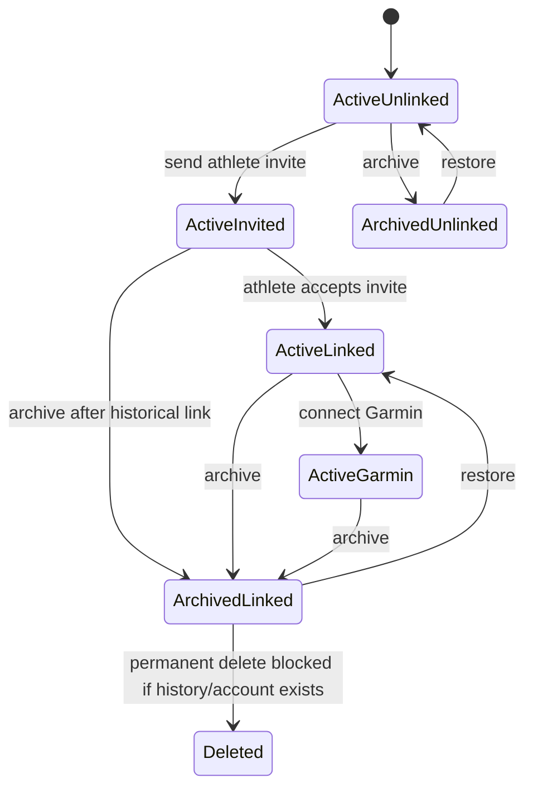

# Lifecycle State Matrix

This document defines the important state combinations in Pulsi so staff UI, athlete UI, and Garmin integration behavior stay consistent.

## Core entities

- `athletes`
  - Domain player record inside a tenant
  - Status: `active`, `inactive`, `rehab`
- `athlete_invites`
  - Invitation/setup flow for athlete Pulsi accounts
  - Status: `pending`, `accepted`, `expired`, `revoked`
- `athlete_accounts`
  - Durable link between a Better Auth user and an athlete profile
  - Status: `active`, `revoked`
- `athlete_integrations`
  - Garmin connection owned by the athlete profile
  - Status: `active`, `revoked`

## Important distinction

Pulsi has two different truths:

- `active access`
  - whether a user can log in as an athlete right now
- `historical identity`
  - whether this athlete profile has ever been linked to a Pulsi account

Those must not be conflated.

Example:

- archiving an athlete revokes athlete login access
- but staff roster views should still show that the athlete already linked a Pulsi account

## Athlete lifecycle

## State matrix

### Staff roster projection

| Athlete status | Athlete invite | Athlete account | Garmin | Staff roster account badge | Staff roster Garmin badge | Athlete login allowed |
| --- | --- | --- | --- | --- | --- | --- |
| `active` | none | none | none | `No account` | `No Garmin` | No |
| `active` | `pending` | none | none | `Invite pending` | `No Garmin` | No |
| `active` | `accepted` or none | `active` | none | `Linked` | `No Garmin` | Yes |
| `active` | `accepted` or none | `active` | `active` | `Linked` | `Garmin connected` | Yes |
| `inactive` | none | none | none | `No account` | `No Garmin` | No |
| `inactive` | none | `revoked` | `revoked` or historical | `Linked` | `Garmin connected` if a connection record still exists, otherwise `No Garmin` | No |
| `inactive` | `pending` | none | none | `Invite pending` | `No Garmin` | No |

### Rules behind the roster badge

- `Linked` wins over `Invite pending`
- `Invite pending` wins over `No account`
- A revoked `athlete_account` still counts as historically `Linked` for staff views
- A revoked `athlete_account` does not count as active athlete access

## Archive behavior

Archiving an athlete should do all of the following:

- set `athletes.status = inactive`
- end the active squad assignment
- revoke pending athlete invites
- set `athlete_accounts.status = revoked`
- deactivate Garmin connections

Archiving should not erase:

- the fact that the athlete had a Pulsi account
- the fact that historical Garmin data exists
- past readiness or activity history

## Restore behavior

Restoring an athlete should do all of the following:

- set `athletes.status = active`
- create a new active squad assignment
- set `athlete_accounts.status = active` if a historical athlete account exists

Restoring should not:

- create a second athlete account
- create a second athlete identity

## Permanent delete behavior

Permanent deletion is allowed only for clean mistaken records.

Delete must be blocked when any of these are true:

- athlete is not archived yet
- athlete has or had a Pulsi athlete account
- athlete has Garmin connection history
- athlete has readiness, health, activity, or wearable-metric history

## Invariants

- One athlete profile can link to at most one Better Auth user
- One Better Auth user can link to at most one athlete profile
- One athlete can have at most one active squad assignment
- Staff memberships are separate from athlete accounts
- Garmin belongs to the athlete profile, never directly to the Better Auth user

## Test cases that must stay green

- Active linked athlete shows `Linked`
- Archived previously linked athlete still shows `Linked`
- Active pending invite athlete shows `Invite pending`
- Archived athlete without invite/account history shows `No account`
- Archive revokes athlete login access
- Restore reactivates athlete login access
- Permanent delete rejects historical Pulsi-account athletes
- Permanent delete rejects Garmin/history-bearing athletes
