# Pulsi System Diagrams

This document is the fastest way to understand how the main parts of Pulsi fit together.

Use it together with:
- [architecture.md](/Users/ea/Desktop/projects/pulsi-app/docs/architecture.md)
- [AUTH_AND_ACTOR_MODEL.md](/Users/ea/Desktop/projects/pulsi-app/docs/architecture/AUTH_AND_ACTOR_MODEL.md)
- [GARMIN_INTEGRATION.md](/Users/ea/Desktop/projects/pulsi-app/docs/integrations/GARMIN_INTEGRATION.md)

## 1. Big Picture

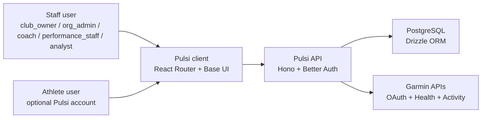

## 2. Main Actor Model

Pulsi has two different authenticated actor types.

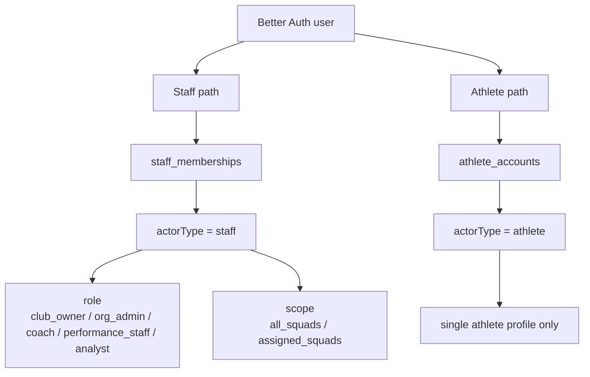

## 3. Staff vs Athlete Access

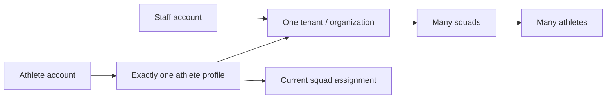

Key rule:
- `staff_memberships` are for staff only
- `athlete_accounts` are for athlete logins only

## 4. Organization Structure

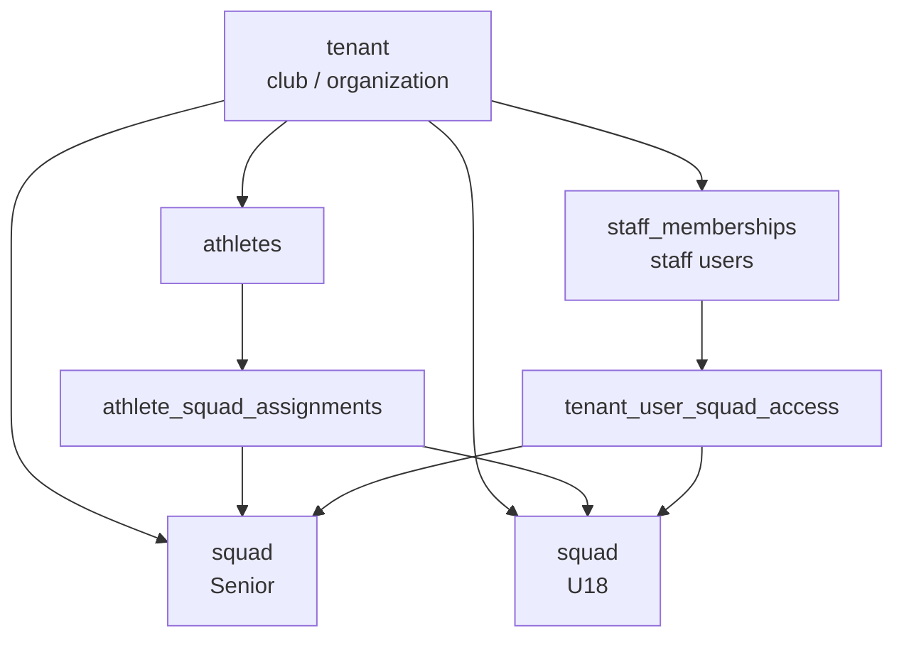

## 5. Athlete Lifecycle

Creating an athlete profile does not create a Pulsi user account.

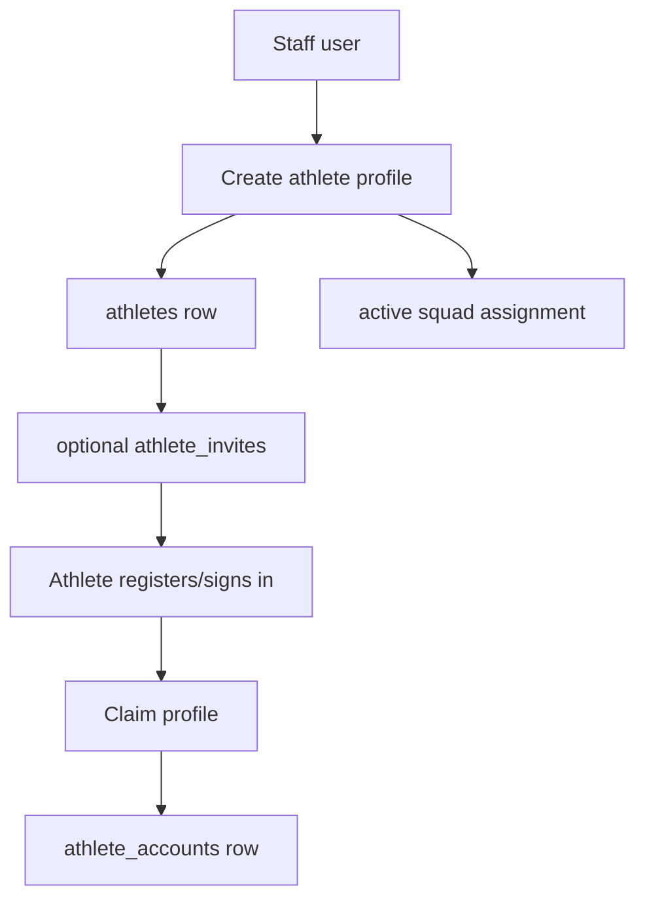

Meaning:
- athlete profile first
- athlete login later
- those are intentionally separate steps

## 6. Garmin Connection Model

Garmin is connected to an athlete profile, not to a staff user.

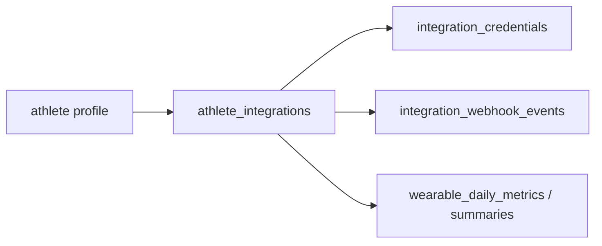

Important:
- staff can initiate Garmin connect for an athlete
- athlete users can also connect Garmin for themselves
- the saved Garmin connection still belongs to the athlete record

## 7. Garmin OAuth Flow

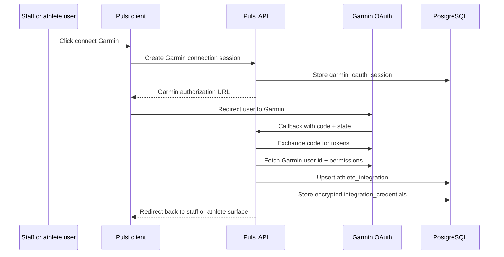

## 8. Garmin Data Ingestion Flow

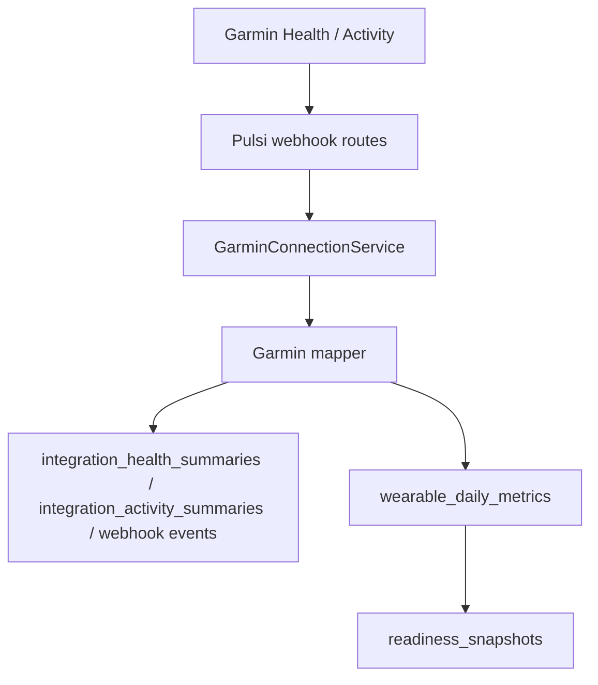

Think of this as:
- Garmin sends raw vendor data
- Pulsi stores it
- Pulsi normalizes it
- Pulsi derives coach-facing readiness

## 9. Request Context Resolution

This is what happens on every authenticated request.

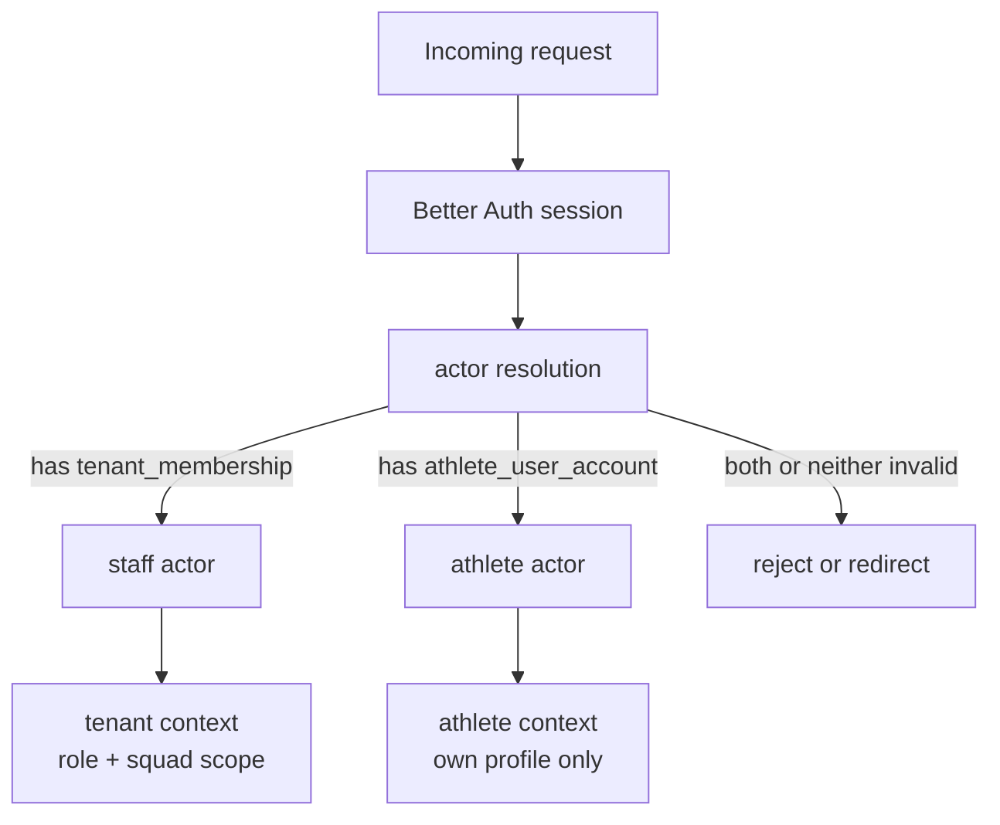

## 10. What A Coach Sees vs What An Athlete Sees

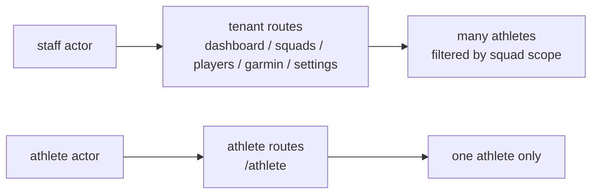

## 11. Database Identity Rules

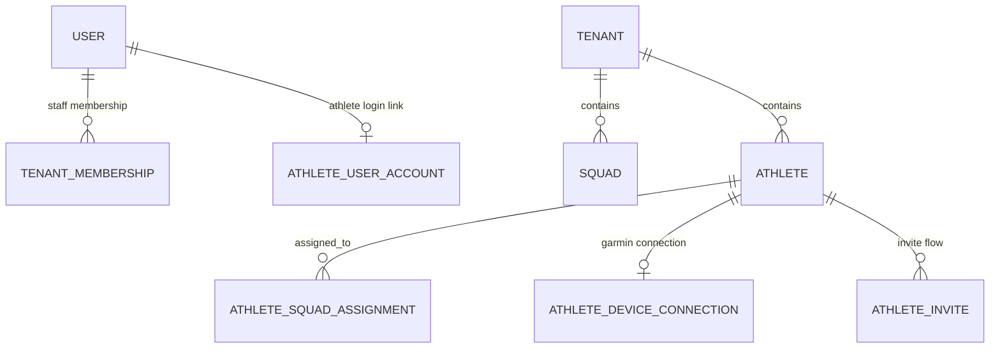

Read this carefully:
- a staff user belongs to one tenant through `staff_memberships`
- an athlete login links to one athlete through `athlete_accounts`
- an athlete belongs to one tenant and one active squad at a time
- Garmin links to the athlete, not directly to the user

## 12. Mental Model Summary

If you remember only six things, remember these:

1. `user` is the authentication identity for both staff and athletes.
2. `staff_memberships` are only for staff.
3. `athletes` are domain records, created independently of user accounts.
4. `athlete_accounts` connect a Better Auth user to exactly one athlete profile.
5. Garmin connections are saved on the athlete profile.
6. Staff see organization data; athlete users only see their own data.

## 13. Current Product Flows

### Staff flow

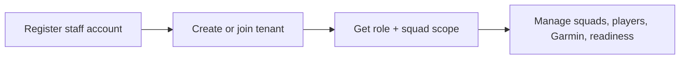

### Athlete flow

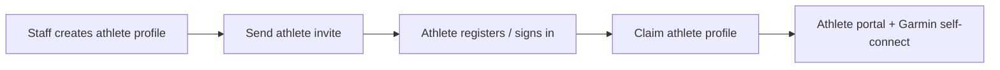

## 14. Why This Feels Complex

The complexity mostly comes from Pulsi having:
- two actor types
- one shared auth system
- one tenant model for staff
- one athlete domain model for players
- one external identity system for Garmin

That means a single real person can participate in multiple layers:
- Pulsi auth identity
- staff membership or athlete link
- athlete domain profile
- Garmin external account

The diagrams above separate those layers on purpose.
